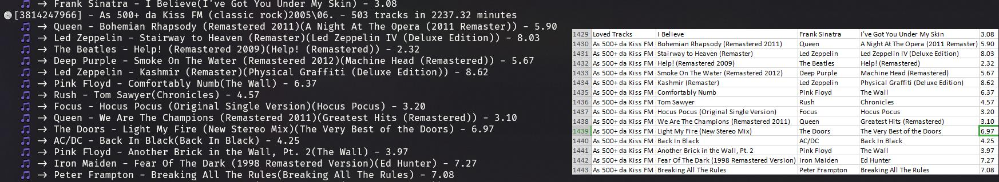

<h1 align="center">🎵 Simple Deezer Playlist Exporter ⬇️</h1>


> A simple deezer playlist exporter using public api. Playlists must be public.
> 



## 🔨 Install

```sh
yarn
or
npm
```

## ✔️ Usage

The number is the user id

```sh
nodejs index.js 123456789 -e csv playlist.csv
nodejs index.js 123456789 -e pretty
nodejs index.js 123456789
```

<i>OBS: This project is a simple study that resulted in a POC, it's not well formatted neither refactored. Must not work for huge playlists, and should not be used for big projects</i>

## Author

👤 **Matheus Vargem**

* Github: [@busycore](https://github.com/busycore)
* LinkedIn: [@matheusvargem](https://linkedin.com/in/matheusvrgm)
